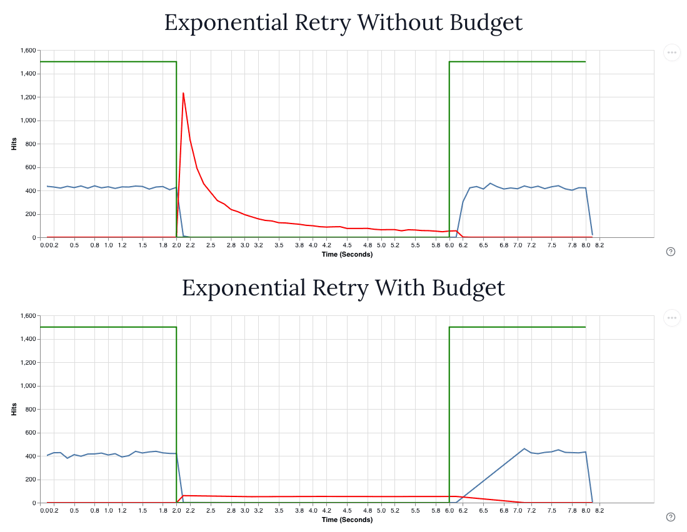

<h2 align="center">
<br />
A tackle box of libraries for golang.
</h2>

[](https://github.com/kapetan-io/tackel/releases/)
[](https://github.com/kapetan-io/tackle/actions?query=workflow:"CI")
[](#license)

All packages have ZERO external dependencies outside the standard golang library. The only exception is for tests
which depend upon `github.com/stretchr/testify`. Tackle is intended as a place for small, but useful packages which
any golang developer may find useful, without a needing a dependency review.

## Libraries
- [Set](#set-config-values) - Avoid the if/else spaghetti of configuration defaults
- [Random](#random) - Functions to generate random data for testing
- [Clock](#clock) - Freeze, Set and Advance time during testing
- [Color](#color) - Add colorized output to slog messages
- [AutoTLS](#autotls) - Generate TLS certificates automatically
- [Wait](#wait) - Simple go routine management with fan out and go routine cancellation
- [Retry](#retry) - Retry functions with exponential backoff and retry budgets

## SET config values
Simplify setting default values during configuration.
```go
package main

import "github.com/kapetan-io/tackle/set"

var Config struct {
    Bang float64
    Foo  string
    Bar  int
}

config := Config{}

// Sets Bar to 200 if Bar is not already set
set.Default(&config.Bar, 200)

// Supply additional default values and set.Default() will
// choose the first default that is not of zero value
set.Default(&config.Foo, os.Getenv("FOO"), "default")

// Sets Bang to the environment variable "BANG" if set, else sets the
// value to 5.0
set.Default(&config.Bang, set.EnvNumber[float64]("BANG"), 5.0)

// Use set.Override() to assign the first value that is not empty or of zero
// value. 
loadFromFile(&config)
argFoo = flag.String("foo", "", "foo via cli arg")

// The following will override the config file if 'foo' is provided via
// the cli or defined in the environment.
set.Override(&config.Foo, *argFoo, os.Env("FOO"))

// Returns true if 'value' is zero (the default golang value)
var value string
set.IsZero(value)

// Returns true if 'value' is zero (the default golang value)
set.IsZeroValue(reflect.ValueOf(value))
```

## Random
Is a collection of functions which are useful in testing
```go
package main

import "github.com/kapetan-io/tackle/random"

// Generates a random alpha/numeric string that starts with `prefix-`
// and 10 random characters
str := random.String("prefix-", 10)

// Generates a random string of ONLY alpha characters that starts 
// with `prefix-` and 10 random alpha characters
alphaChars := random.Alpha("prefix-", 10)

// One returns one of the strings randomly
one := random.One("string1", "string2", "string3")

// Runes returns a random string made up of characters passed. In this case, uses the
// AlphaRunes and NumericRunes.
str = random.Runes("prefix-", 10, random.AlphaRunes, random.NumericRunes)

// Duration returns a random duration not exceeding the max duration provided
d := random.Duration(time.Millisecond, time.Second)
// Returns a random duration between 1 minute long and 60 minutes long.
d = random.Duration(time.Minute, 60*time.Minute)

// Slice return a random item from the provided slice
type pair struct{ Key, Value string }
p := random.Slice([]pair{{Key: "key1", Value: "value1"}, {Key: "key2", Value: "value2"}})
```

## Clock
Is intended as a drop in replacement for the golang standard time package. It allows any package using `clock` to 
freeze, set and advance time during testing. 

#### Thread Safety
Freezing time presents a race condition when time is frozen. This is because `clock.Freeze()` replaces a standard
time singleton private to the `clock` package with a frozen time singleton. If `clock.Freeze()` is called at the
same time as it's being accessed in another go routine, a race condition occurs.

Provided you only use `clock.Freeze()`  in tests -- which is how it is intended to be used -- you can provide a build 
tag `-tags clock_mutex` which will build `clock` with a mutex that protects the singleton. You can safely omit the 
build tag when building your application for production to avoid mutex contention.

#### Scheduled Functions
Scheduled functions are called from within the go routine which called `clock.Advanced()` unlike standard time package
which calls them in their own goroutine.

#### Performance
We have successfully used clock in very high concurrency applications with no impact on performance. The only overhead
introduced by `clock` is a single pointer deref and an inline method call to time.X(). All method calls to `Time`
and `Duration` structs are not affected by `clock` only the package level functions.

See
* [Gubernator](https://github.com/gubernator-io/gubernator) A high performance rate limiting service
* [Querator](https://github.com/kapetan.io/gubernator) An efficient reservation queue

```go
package main

import (
    "fmt"
	"github.com/kapetan-io/tackle/clock"
)

func main() {
    // Freeze freezes the current time
    clock.Freeze(clock.Now())
    // UnFreeze restores clock to current date/time.
    defer clock.UnFreeze()

    // You can also use a one-liner in tests
    // defer clock.Freeze(clock.Now()).UnFreeze()

    // Set a function to run in 100ms
    var fired bool
    clock.AfterFunc(100*clock.Millisecond, func() {
        fired = true
    })
       
    // Advance the clock 201ms into the future
    clock.Advance(201*clock.Millisecond)

    // Advance() forces all events, timers, tickers to fire that are scheduled for the
    // passed period of time.
    if fired {
        fmt.Println("We have arrived in the future!")
    }

    // Create an isolated clock provider for localised time control
    p1 := clock.NewProvider()
    p1.Freeze(clock.Now())
    defer p1.UnFreeze()

	// Advance the provider by 10 seconds.
    p1.Advance(10 * clock.Second)
    future := p1.Now().UTC()
    now := clock.Now().UTC()
    fmt.Printf("%s is ten seconds ahead of %s\n", future, now)
}
```

## Color
Is intended as a drop in replacement for `slog.NewTextHandler()` when developing locally or running tests. The 
colorized output of log messages can make spotting errors in walls of text much easier.

```go
package main

import (
    "fmt"
    "github.com/kapetan-io/tackle/color"
    "log/slog"
)

func main() {
    fmt.Printf("\n--- Default Options ---\n")
    log := slog.New(color.NewLog(nil))
    
    log.Debug("This is a debug", "attr1", 2319, "attr2", "foo")
    log.Info("This is a info", "attr1", 2319, "attr2", "foo")
    log.Warn("This is a warning", "attr1", 2319, "attr2", "foo")
    log.Error("This is an error", "attr1", 2319, "attr2", "foo")
    log.Log(context.Background(), slog.LevelError+1, "This is a error+1")
    log.Log(context.Background(), slog.LevelError+2, "This is a error+2")

    log = slog.New(color.NewLog(&color.LogOptions{MsgColor: color.FgHiWhite}))
    log.Info("This is color.FgHiWhite message", "attr1", 2319, "attr2", "foo")
    log = slog.New(color.NewLog(&color.LogOptions{MsgColor: color.FgHiBlue}))
    log.Info("This is color.FgHiBlue message", "attr1", 2319, "attr2", "foo")

    fmt.Printf("\n--- color.SupressAttrs(slog.TimeKey) ---\n")
    log = slog.New(color.NewLog(&color.LogOptions{
        HandlerOptions: slog.HandlerOptions{
        ReplaceAttr: color.SuppressAttrs(slog.TimeKey),
    }}))
   
    log.Debug("This is a debug", "attr1", 2319, "attr2", "foo")
    log.Info("This is a info", "attr1", 2319, "attr2", "foo")
    log.Warn("This is a warning", "attr1", 2319, "attr2", "foo")
    log.Error("This is an error", "attr1", 2319, "attr2", "foo")
    log.Log(context.Background(), slog.LevelError+1, "This is a error+1")
    log.Log(context.Background(), slog.LevelError+2, "This is a error+2")
}
```


## AutoTLS
Provides functions which can generate TLS certificates suitable for both client and server certificates.
The package can configure a ready to use `*tls.Config` for both client and server depending on the
`autotls.Config` provided.

With Support For
- User provided certificate files `*.pem`
- Client side TLS configs
- Automatic generation of valid client and server TLS configs
- Client side TLS authentication
- Skip insecure

See `autotls.Config` for all available options.

```go
package main

import (
	"errors"
	"fmt"
	"io"
	"net/http"
    
	"github.com/kapetan-io/tackle/autotls"
)

func main() {
    tls := autotls.Config{
        // Optionally provide your own certificates
        //CaFile:           "certs/ca.cert",
        //CertFile:         "certs/auto.pem",
        //KeyFile:          "certs/auto.key",

        // Optionally setup client side cert authentication
        //ClientAuthCaFile: "certs/client-auth-ca.pem",
        //ClientAuth:       tls.RequireAndVerifyClientCert,

        // Generate both client and server certs on the fly
        AutoTLS: true,
    }

    err := autotls.Setup(&tls)
    if err != nil {
        panic(err)
    }

    // After Setup() returns without error `tls` will be populated with
    // relevant TLS config information.
    // tls.ServerTLS <-- the server certificates
    // tls.ClientTLS <-- the client certificates

    srv := http.Server{
        Addr: "localhost:9685",
        Handler: http.HandlerFunc(func(w http.ResponseWriter, r *http.Request) {
            _, _ = fmt.Fprintln(w, "Hello, client")
        }),
        // ServerTLS is the TLS certificate for use by the server
        TLSConfig: tls.ServerTLS,
    }
    defer srv.Close()

    go func() {
        // CertFile and KeyFile are provided via autotls.ServerTLS
        err = srv.ListenAndServeTLS("", "")
        if err != nil && !errors.Is(http.ErrServerClosed, err) {
            fmt.Printf("server listen error: %v", err)
        }
    }()

    c := &http.Client{
        // TLSClientConfig is the client side TLS certificate
        Transport: &http.Transport{TLSClientConfig: tls.ClientTLS},
    }

    resp, err := c.Get("https://localhost:9685/")
    if err != nil {
        panic(err)
    }
    defer resp.Body.Close()
    b, err := io.ReadAll(resp.Body)
    if err != nil {
        panic(err)
    }
    fmt.Printf("Client: %s\n", string(b))
}
```

## Wait
`Wait.Group` is a simplification of golang standard `sync.Waitgroup` with item and error collection included. 

> NOTE: You should not use `wait` with golang 1.21 or less. 1.22 fixes closure scope issues with previous golang versions.
> See https://go.dev/blog/loopvar-preview for details

Run many routines over a collection with `.Go()`
```go
import "github.com/kapetan-io/tackle/wait"
items := []int{0, 1, 3, 4, 5}

var wg wait.Group
for _, item := range items {
    wg.Go(func() {
        fmt.Printf("Item: %d\n", item)
        time.Sleep(time.Nanosecond * 50)
    })
}

wg.Wait()
```

Loop `.Until()` `.Stop()`is called
```go
import "github.com/kapetan-io/tackle/wait"
var wg wait.Group

wg.Until(func(done chan struct{}) bool {
    select {
    case <-time.Tick(time.Second):
        // Do some periodic thing
    case <-done:
        return false
    }
    return true
})

// Close the done channel and wait for the routine to exit
wg.Stop()
```

#### Group API
- `Group.Go()` - Runs the provided function in a goroutine
- `Group.Loop()` - Runs the provided function in a goroutine until the function returns false
- `Group.Run()` - Runs the provided function in a goroutine collecting any errors which is returned by `Group.Wait()`
- `Group.Until()` - Runs the provided function until `Group.Stop()` is called

### FanOut
FanOut spawns a new go-routine each time `.Run()` is called until `size` is reached, subsequent calls to `.Run()`
will block until previous `.Run()` routines have completed. This API allows the user to control how many routines
will run concurrently. Calling `.Wait()` then collects any errors from the routines once they have all completed.

NOTE: `FanOut` allows you to control how many goroutines spawn at a time while `WaitGroup` will not.

```go
import "github.com/kapetan-io/tackle/wait"

// Insert 10 items into a cassandra database concurrently
fanOut := wait.NewFanOut(10)

for _, item := range items {
    fanOut.Run(func() error {
        return db.ExecuteQuery("INSERT INTO tbl (id, field) VALUES (?, ?)",
            item.Id, item.Field)
        return nil
    })
}

// Wait for any outstanding go routines
// to finish and collect errors if any
err := fanOut.Wait()
if err != nil {
    panic(err)
}
```

## Retry
Read why implementing a quality retry strategy is important:
[Good retry, Bad Retry](https://medium.com/yandex/good-retry-bad-retry-an-incident-story-648072d3cee6)

<h2 align="center">

</h2>

- RED line indicates the number of retries
- GREEN line indicates the availability of the resource
- BLUE line indicates successful access of the resource.

You can see how exponential backoff retry results in a high occurrence of retries during the beginning of the outage
while an exponential backoff WITH a simple budget limits it's impact on the resource during outage. However, 
recovery time is quicker with simple exponential back off than with simple budget, as the budget window must expire 
before requests are allowed again. This test preformed with `retry.NewSimpleBudget()` and `retry.PolicyDefault`
exponential back off configuration -- the same one used by Google's Java Client.

#### Usage
The retry package is a collection of functions and structs which allow the creation of custom retry exponential back
off policies and retry budgets within your application. It also includes common test helpers useful for implementing
functional tests. Retries are cancelable via `context.Context` and by returning `retry.ErrCancelRetry` from the call
back function.
```go
import "github.com/kapetan-io/tackle/retry"

ctx, cancel := context.WithCancel(context.Background())
var resp DoThingResponse

// If DoThing() returns an error, this operation is retried using the retry.PolicyDefault
// which is an exponential backoff. Retries continue until the context is cancelled
err := retry.Until(ctx, func(ctx context.Context, attempt int) error {
    return DoThing(ctx, &DoThingRequest{}, &resp)
})

// If DoThing() returns an error, this operation is retried until the number of attempts 
// has expired and sleeps between retries starting with the provided sleep time (5 seconds)
// and increments sleep time using the default exponential back off interval 
// `retry.IntervalBackOff`
err = retry.UntilAttempts(ctx, 10, time.Second, func(ctx context.Context, _ int) error {
    return DoThing(ctx, &DoThingRequest{}, &resp)
})

// Define a custom retry policy (thread safe) which can be used globally by all
// retry.Do() calls in the application.
p := retry.Policy{
    // With a custom back off configuration
    Interval: retry.IntervalBackOff{
        Min:    time.Millisecond,
        Max:    time.Millisecond * 100,
        Factor: 2,
    },
    // Infinite retry if `Attempts = 0`
    Attempts: 5,
    // Optional budget to ensure the resource being retried
    // isn't overloaded with retries
    Budget: nil,
}

// If DoThing() returns an error, this operation is retried using the provided policy
err = retry.On(ctx, p, func(ctx context.Context, attempt int) error {
	return DoThing(ctx, &DoThingRequest{}, &resp)
})
```

#### Integrate Retry with custom code
The `Policy` and `Interval` interfaces are designed to be re-used outside the `retry` package, for users who need
more fine grain control of their retry strategies. To use an `Interval` in custom code, simply instantiate the
`Interval` then call `Next()` on the interval to retrieve the next sleep duration based on the number of attempts.

```go
var it = retry.IntervalBackOff {
    Rand:   rand.New(rand.NewSource(time.Now().UnixNano())),
    Min:    500 * time.Millisecond,
    Max:    time.Minute,
    Factor: 1.5,
    Jitter: 0.5,
}

func YourRemoteCall(ctx context.Context) {
    var attempt int
    for {
        select {
        case <-ctx.Done():
            return ctx.Err()
        default:
            _, err := http.Get("https://google.com")
            if err != nil {
                time.Sleep(it.Next(attempt))
                attempt++
                continue
            }
            break
        }
    }
}
```

#### Retry Test Helpers
These retry helpers are useful when building E2E or Functional tests where a collection of tests will eventually pass
due to some async nature of the application being tested.

```go
func TestTellJoke(t *testing.T) {
    // Continues to run the assertions up to 10 times, sleeping 100ms in between retries
    // until all the assertions pass or attempts are exhausted.
    pass := retry.UntilPass(t, 10, time.Millisecond*100, func (t retry.TestingT) {
        resp, err := TellJoke()

        // `require` assertion protects the test from progressing if there is an error
        require.NoError(t, err)
        require.NotNil(t, resp)

        assert.Equal(t, true, resp.HasSomeJokes)
        assert.Equal(t, "your mom so fat...", resp.Answer)

        // You can also use non testify assertions
        if resp.IsFunny != true {
            t.Errorf("response was not funny")
        }
    })

    // If UntilPass() returns true, we know the test eventually passed
    //and our test can continue.
    require.True(t, pass)
}
```

When testing services, it is very common for the test to wait until the service under test is running and
accepting connections, for such tests. `retry.UntilConnect()` is very useful
```go
func TestWaitServer(t *testing.T) {
    // Start our service
    s := service.SpawnServer()

    // Wait until we can connect, then continue with the test
    retry.UntilConnect(t, 10, time.Millisecond*100, s.Address())

    // We can now safely send requests to the server
    c, err := service.NewClient(s)
    require.NoError(t, err)
    resp, err := c.TellJoke()
    require.NoError(t, err)
    assert.NotNil(t, resp)
}
```

#### Budgets
A budget can be a shared global budget for the application which limits the total number of retries.
Custom thread safe budgets can be defined and shared across the application which obey rate limits imposed
by the resource being retried.

Once the number of retries exceeds the budget, `retry.Do()` will sleep using the provided `Interval` asking
the budget if the `Budget.IsOver()` the budget limit, only allowing the retry to occur if we are within
retry budget.

```go
// Defines a simple 500 request per second budget (Thread safe)
budget := retry.NewSimpleBudget(500, time.Second)

var Policy = retry.Policy{
    // How we calculate the sleep time between retries and between budget checks
    Interval: retry.IntervalBackOff{
        Rand:   rand.New(rand.NewSource(time.Now().UnixNano())),
        Min:    500 * time.Millisecond,
        Max:    time.Minute,
        Factor: 1.5,
        Jitter: 0.5,
    },
    // Specify the budget to be used for this policy
    Budget:   budget,
    // Infinite retries
    Attempts: 0,
}
```

#### Retry CLI
Retry includes a CLI used to calculate an exponential backoff schedule, useful in testing back off configurations

Installation
```bash
$ go install ./cmd/retry
```

Execution and Usage
```bash
$ retry
  Usage: retry -attempts 10 -min 500ms -max 1m0s -factor 1.5 -jitter 0.5

  Attempt: 0 BackOff: 500ms WithJitter: 359.736082ms Jitter Range: [250ms - 750ms]
  Attempt: 1 BackOff: 750ms WithJitter: 675.611954ms Jitter Range: [375ms - 1.125s]
  Attempt: 2 BackOff: 1.125s WithJitter: 611.039003ms Jitter Range: [562.5ms - 1.6875s]
  Attempt: 3 BackOff: 1.6875s WithJitter: 1.955070657s Jitter Range: [843.75ms - 2.53125s]
  Attempt: 4 BackOff: 2.53125s WithJitter: 2.561133823s Jitter Range: [1.265625s - 3.796875s]
  Attempt: 5 BackOff: 3.796875s WithJitter: 5.508541149s Jitter Range: [1.8984375s - 5.6953125s]
  Attempt: 6 BackOff: 5.6953125s WithJitter: 4.373686656s Jitter Range: [2.84765625s - 8.54296875s]
  Attempt: 7 BackOff: 8.54296875s WithJitter: 6.257106109s Jitter Range: [4.271484375s - 12.814453125s]
  Attempt: 8 BackOff: 12.814453125s WithJitter: 12.994089755s Jitter Range: [6.407226562s - 19.221679687s]
  Attempt: 9 BackOff: 19.221679687s WithJitter: 13.437161293s Jitter Range: [9.610839843s - 28.83251953s]
```

#### Retry API
Retry
- `retry.On()` - Retries the provided operation using the policy provided
- `retry.Until()` - Retries the provided operation until it succeeds
- `retry.UntilAttempts()` - Identical to Until but with Attempts and initial sleep interval
- `retry.Interval` - The interval interface
- `retry.IntervalSleep` - An interval implementation that sleeps a constant duration each interval
- `retry.IntervalBackOff` - An exponential backoff interval implementation
- `retry.IntervalBackOff.Explain()` - Explains how the sleep duration was calculated
- `retry.IntervalBackOff.ExplainString()` - Identical to Explain() but returned as a string
- `retry.Policy` - The policy struct used by `On()`, `Until()` and `UntilAttempts()`
- `retry.PolicyDefault` - The default exponential backoff policy
- `retry.ErrCancelRetry` - Used with `On()`, `Until()` and `UntilAttempts()` to cancel the retry loop

Testing
- `retry.UntilPass()` - Retry tests using `testing.T` until they pass
- `retry.UntilConnect()` - Returns when the address is accepting connections

Budgets
- `retry.Budget` - the budget interface
- `retry.NewSimpleBudget()` - Creates a simple single time window based budget

Rates
- `retry.NewRate` - Used to build complex Budgets like sliding window or rate limit based Budgets

## Mailgun History
Several of the packages here are modified versions of libraries used successfully during my time at
[Mailgun](https://github.com/mailgun). Some of the original packages can be found
[here](https://github.com/mailgun/holster).

Tackle differs from Holster in one specific way, unlike Holster which became a dumping ground for often used
libraries and useful tools internal to Mailgun. Tackle is strictly for packages with no external dependencies other
than the golang standard library.
