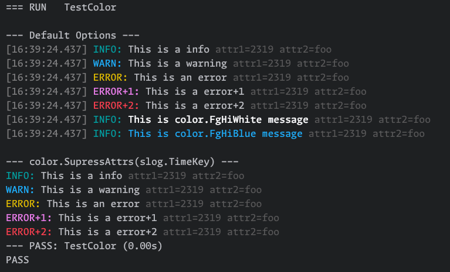

<h2 align="center">
<br />
A tackle box of libraries for golang.
</h2>

[](https://github.com/kapetan-io/tackel/releases/)
[](https://github.com/kapetan-io/tackle/actions?query=workflow:"CI")
[](#license)

All packages have ZERO external dependencies outside the standard golang library. The only exception is for tests
which depend upon `github.com/stretchr/testify`. Tackle is intended as a place for small, but useful packages which
any golang developer may find useful, without a needing a dependency review.

## Libraries
- [Set](#set-config-values) - Avoid the if/else spaghetti of configuration defaults
- [Random](#random) - Functions to generate random data for testing
- [Clock](#clock) - Freeze, Set and Advance time during testing
- [Color](#color) - Add colorized output to slog messages
- [AutoTLS](#autotls) - Generate TLS certificates automatically
- [Wait](#wait) - Simple go routine management with fan out and go routine cancellation
- [Retry](#retry) - Retry with exponential backoff and retry budgets

## SET config values
Simplify setting default values during configuration.
```go
package main

import "github.com/kapetan-io/tackle/set"

var Config struct {
    Bang float64
    Foo  string
    Bar  int
}

config := Config{}

// Sets Bar to 200 if Bar is not already set
set.Default(&config.Bar, 200)

// Supply additional default values and set.Default() will
// choose the first default that is not of zero value
set.Default(&config.Foo, os.Getenv("FOO"), "default")

// Sets Bang to the environment variable "BANG" if set, else sets the
// value to 5.0
set.Default(&config.Bang, set.EnvNumber[float64]("BANG"), 5.0)

// Use set.Override() to assign the first value that is not empty or of zero
// value. 
loadFromFile(&config)
argFoo = flag.String("foo", "", "foo via cli arg")

// The following will override the config file if 'foo' is provided via
// the cli or defined in the environment.
set.Override(&config.Foo, *argFoo, os.Env("FOO"))

// Returns true if 'value' is zero (the default golang value)
var value string
set.IsZero(value)

// Returns true if 'value' is zero (the default golang value)
set.IsZeroValue(reflect.ValueOf(value))
```

## Random
Is a collection of functions which are useful in testing
```go
package main

import "github.com/kapetan-io/tackle/random"

// Generates a random alpha/numeric string that starts with `prefix-`
// and 10 random characters
str := random.String("prefix-", 10)

// Generates a random string of ONLY alpha characters that starts 
// with `prefix-` and 10 random alpha characters
alphaChars := random.Alpha("prefix-", 10)

// One returns one of the strings randomly
one := random.One("string1", "string2", "string3")

// Runes returns a random string made up of characters passed. In this case, uses the
// AlphaRunes and NumericRunes.
str = random.Runes("prefix-", 10, random.AlphaRunes, random.NumericRunes)

// Duration returns a random duration not exceeding the max duration provided
d := random.Duration(time.Millisecond, time.Second)
// Returns a random duration between 1 minute long and 60 minutes long.
d = random.Duration(time.Minute, 60*time.Minute)

// Slice return a random item from the provided slice
type pair struct{ Key, Value string }
p := random.Slice([]pair{{Key: "key1", Value: "value1"}, {Key: "key2", Value: "value2"}})
```

## Clock
Is intended as a drop in replacement for the golang standard time package. It allows any package using `clock` to 
freeze, set and advance time during testing. 

#### Thread Safety
Freezing time presents a race condition when time is frozen. This is because `clock.Freeze()` replaces a standard
time singleton private to the `clock` package with a frozen time singleton. If `clock.Freeze()` is called at the
same time as it's being accessed in another go routine, a race condition occurs.

Provided you only use `clock.Freeze()`  in tests -- which is how it is intended to be used -- you can provide a build 
tag `-tags clock_mutex` which will build `clock` with a mutex that protects the singleton. You can safely omit the 
build tag when building your application for production to avoid mutex contention.

#### Scheduled Functions
Scheduled functions are called from within the go routine which called `clock.Advanced()` unlike standard time package
which calls them in their own goroutine.

#### Performance
We have successfully used clock in very high concurrency applications with no impact on performance. The only overhead
introduced by `clock` is a single pointer deref and an inline method call to time.X(). All method calls to `Time`
and `Duration` structs are not affected by `clock` only the package level functions.

See
* [Gubernator](https://github.com/gubernator-io/gubernator) A high performance rate limiting service
* [Querator](https://github.com/kapetan.io/gubernator) An efficient reservation queue

```go
package main

import (
    "fmt"
	"github.com/kapetan-io/tackle/clock"
)

func main() {
    // Freeze freezes the current time
    clock.Freeze(clock.Now())
    // UnFreeze restores clock to current date/time.
    defer clock.UnFreeze()

    // You can also use a one-liner in tests
    // defer clock.Freeze(clock.Now()).UnFreeze()

    // Set a function to run in 100ms
    var fired bool
    clock.AfterFunc(100*clock.Millisecond, func() {
        fired = true
    })
       
    // Advance the clock 201ms into the future
    clock.Advance(201*clock.Millisecond)

    // Advance() forces all events, timers, tickers to fire that are scheduled for the
    // passed period of time.
    if fired {
        fmt.Println("We have arrived in the future!")
    }

    // Create an isolated clock provider for localised time control
    p1 := clock.NewProvider()
    p1.Freeze(clock.Now())
    defer p1.UnFreeze()

	// Advance the provider by 10 seconds.
    p1.Advance(10 * clock.Second)
    future := p1.Now().UTC()
    now := clock.Now().UTC()
    fmt.Printf("%s is ten seconds ahead of %s\n", future, now)
}
```

## Color
Is intended as a drop in replacement for `slog.NewTextHandler()` when developing locally or running tests. The 
colorized output of log messages can make spotting errors in walls of text much easier.

```go
package main

import (
    "fmt"
    "github.com/kapetan-io/tackle/color"
    "log/slog"
)

func main() {
    fmt.Printf("\n--- Default Options ---\n")
    log := slog.New(color.NewLog(nil))
    
    log.Debug("This is a debug", "attr1", 2319, "attr2", "foo")
    log.Info("This is a info", "attr1", 2319, "attr2", "foo")
    log.Warn("This is a warning", "attr1", 2319, "attr2", "foo")
    log.Error("This is an error", "attr1", 2319, "attr2", "foo")
    log.Log(context.Background(), slog.LevelError+1, "This is a error+1")
    log.Log(context.Background(), slog.LevelError+2, "This is a error+2")

    log = slog.New(color.NewLog(&color.LogOptions{MsgColor: color.FgHiWhite}))
    log.Info("This is color.FgHiWhite message", "attr1", 2319, "attr2", "foo")
    log = slog.New(color.NewLog(&color.LogOptions{MsgColor: color.FgHiBlue}))
    log.Info("This is color.FgHiBlue message", "attr1", 2319, "attr2", "foo")

    fmt.Printf("\n--- color.SupressAttrs(slog.TimeKey) ---\n")
    log = slog.New(color.NewLog(&color.LogOptions{
        HandlerOptions: slog.HandlerOptions{
        ReplaceAttr: color.SuppressAttrs(slog.TimeKey),
    }}))
   
    log.Debug("This is a debug", "attr1", 2319, "attr2", "foo")
    log.Info("This is a info", "attr1", 2319, "attr2", "foo")
    log.Warn("This is a warning", "attr1", 2319, "attr2", "foo")
    log.Error("This is an error", "attr1", 2319, "attr2", "foo")
    log.Log(context.Background(), slog.LevelError+1, "This is a error+1")
    log.Log(context.Background(), slog.LevelError+2, "This is a error+2")
}
```


## AutoTLS
Provides functions which can generate TLS certificates suitable for both client and server certificates.
The package can configure a ready to use `*tls.Config` for both client and server depending on the
`autotls.Config` provided.

With Support For
- User provided certificate files `*.pem`
- Client side TLS configs
- Automatic generation of valid client and server TLS configs
- Client side TLS authentication
- Skip insecure

See `autotls.Config` for all available options.

```go
package main

import (
	"errors"
	"fmt"
	"io"
	"net/http"
    
	"github.com/kapetan-io/tackle/autotls"
)

func main() {
    tls := autotls.Config{
        // Optionally provide your own certificates
        //CaFile:           "certs/ca.cert",
        //CertFile:         "certs/auto.pem",
        //KeyFile:          "certs/auto.key",

        // Optionally setup client side cert authentication
        //ClientAuthCaFile: "certs/client-auth-ca.pem",
        //ClientAuth:       tls.RequireAndVerifyClientCert,

        // Generate both client and server certs on the fly
        AutoTLS: true,
    }

    err := autotls.Setup(&tls)
    if err != nil {
        panic(err)
    }

    // After Setup() returns without error `tls` will be populated with
    // relevant TLS config information.
    // tls.ServerTLS <-- the server certificates
    // tls.ClientTLS <-- the client certificates

    srv := http.Server{
        Addr: "localhost:9685",
        Handler: http.HandlerFunc(func(w http.ResponseWriter, r *http.Request) {
            _, _ = fmt.Fprintln(w, "Hello, client")
        }),
        // ServerTLS is the TLS certificate for use by the server
        TLSConfig: tls.ServerTLS,
    }
    defer srv.Close()

    go func() {
        // CertFile and KeyFile are provided via autotls.ServerTLS
        err = srv.ListenAndServeTLS("", "")
        if err != nil && !errors.Is(http.ErrServerClosed, err) {
            fmt.Printf("server listen error: %v", err)
        }
    }()

    c := &http.Client{
        // TLSClientConfig is the client side TLS certificate
        Transport: &http.Transport{TLSClientConfig: tls.ClientTLS},
    }

    resp, err := c.Get("https://localhost:9685/")
    if err != nil {
        panic(err)
    }
    defer resp.Body.Close()
    b, err := io.ReadAll(resp.Body)
    if err != nil {
        panic(err)
    }
    fmt.Printf("Client: %s\n", string(b))
}
```

## Wait
`Wait.Group` is a simplification of golang standard `sync.Waitgroup` with item and error collection included. 

> NOTE: You should not use `wait` with golang 1.21 or less. 1.22 fixes closure scope issues with previous golang versions.
> See https://go.dev/blog/loopvar-preview for details

Run many routines over a collection with `.Go()`
```go
import "github.com/kapetan-io/tackle/wait"
items := []int{0, 1, 3, 4, 5}

var wg wait.Group
for _, item := range items {
    wg.Go(func() {
        fmt.Printf("Item: %d\n", item)
        time.Sleep(time.Nanosecond * 50)
    })
}

wg.Wait()
```

Loop `.Until()` `.Stop()`is called
```go
import "github.com/kapetan-io/tackle/wait"
var wg wait.Group

wg.Until(func(done chan struct{}) bool {
    select {
    case <-time.Tick(time.Second):
        // Do some periodic thing
    case <-done:
        return false
    }
    return true
})

// Close the done channel and wait for the routine to exit
wg.Stop()
```

#### Group API
- `Group.Go()` - Runs the provided function in a goroutine
- `Group.Loop()` - Runs the provided function in a goroutine until the function returns false
- `Group.Run()` - Runs the provided function in a goroutine collecting any errors which is returned by `Group.Wait()`
- `Group.Until()` - Runs the provided function until `Group.Stop()` is called

### FanOut
FanOut spawns a new go-routine each time `.Run()` is called until `size` is reached, subsequent calls to `.Run()`
will block until previous `.Run()` routines have completed. This API allows the user to control how many routines
will run concurrently. Calling `.Wait()` then collects any errors from the routines once they have all completed.

NOTE: `FanOut` allows you to control how many goroutines spawn at a time while `WaitGroup` will not.

```go
import "github.com/kapetan-io/tackle/wait"

// Insert 10 items into a cassandra database concurrently
fanOut := wait.NewFanOut(10)

for _, item := range items {
    fanOut.Run(func() error {
        return db.ExecuteQuery("INSERT INTO tbl (id, field) VALUES (?, ?)",
            item.Id, item.Field)
        return nil
    })
}

// Wait for any outstanding go routines
// to finish and collect errors if any
err := fanOut.Wait()
if err != nil {
    panic(err)
}
```

## Mailgun History
Several of the packages here are modified versions of libraries used successfully during my time at [Mailgun](https://github.com/mailgun).
Some of the original packages can be found [here](https://github.com/mailgun/holster). 

Tackle differs from Holster in one specific way, unlike Holster which became a dumping ground for often used libraries and useful 
tools internal to Mailgun. Tackle is strictly for packages with no external dependencies other than the golang standard library. 
